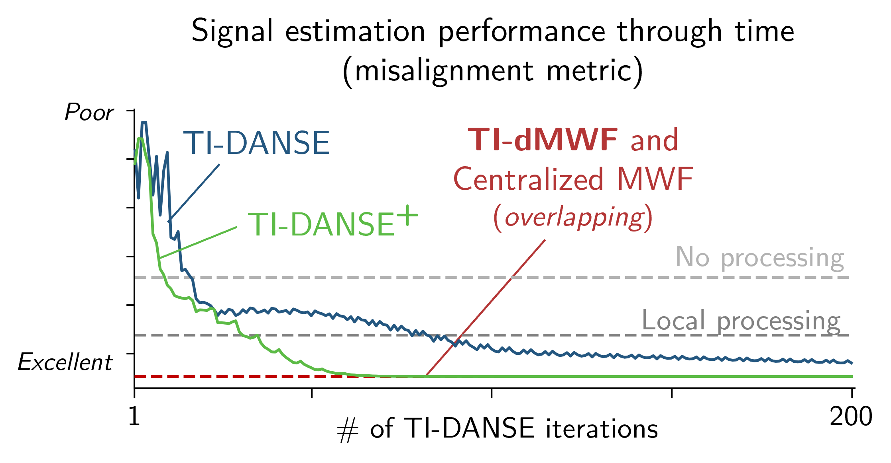

# TI-DMWF Repository

This repository contains the complete parametrizable simulation framework to:
1. Simulate topology-unconstrained wireless acoustic sensor networks (WASNs) in a reverberant acoustic environment.
2. Perform noise reduction (signal estimation) using basic multichannel Wiener filters - either in a centralized fashion at a hypothetical central processing unit, or at the node level.
3. Perform distributed noise reduction (distributed signal estimation) using the dMWF, DANSE, or rS-DANSE for fully connected WASNs, or TI-dMWF or TI-DANSE for non-fully connected WASNs.
4. Post-process simulations results, compute and visualize signal enhancement / noise reduction objective metrics.

## Project Structure

- `README.md`: This file.
- `config/`: Configuration files (YAML).
- `tools/`: Core classes and utility functions.
- `main.py`: Entry point for running simulations. Requires `PATH_TO_CFG` global variable pointing to config file. Runs `pp.py` automatically after the simulation unless specified.
- `pp.py`: Entry point for solely post-processing simulations.
- `precomb_pp.py`: Script to combine outputs of several simulations before post-processing.

## Getting Started

### Prerequisites

- Python 3.8 or higher
- Dependencies listed in `requirements.txt`

### Installation

1. Clone the repository:
        ```sh
        git clone https://github.com/p-didier/ti-dmwf_complete.git
        ```
2. Navigate to the project directory:
        ```sh
        cd ti-dmwf_complete
        ```
3. Install required packages (recommended in a virtual environment):
        ```sh
        pip install -r requirements.txt
        ```

### Usage

1. Configure simulation parameters in the appropriate YAML file under `config/`. Remember to modify the **file paths** for the sound file databases.
2. Set the `PATH_TO_CFG` variable to your config file path.
3. If you want to run batch experiments, adjust `testParams` in `main.py`.
3. Run the main script:
        ```sh
        python main.py
        ```

<p align="center">
  
</p>
<p align="center">
  <b>Figure 1:</b> Snippet from manuscript submitted to IEEE Open Journal of Signal Processing in March 2026. The misalignment metric is the mean squared error between estimated and true desired signal. The simulation is conducted in batch mode.
</p>

## License

This project is licensed under the MIT License - see the LICENSE file for details.

## Acknowledgements

- Paul Didier, KU Leuven university Belgium, STADIUS Center for Dynamical Systems, Signal Processing, and Data Analytics, Electrical Engineering Dept. (ESAT). PhD promotor: Prof. Marc Moonen.

For questions or issues, contact: pauldidier26@gmail.com.
